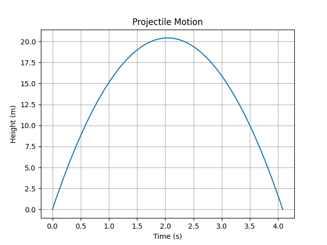

AutoSci 🌌

AI for Automated Science Experiments

“Turn any idea into an experiment, instantly.”

Yes, there are similar efforts (Curie, CodeScientist), but AutoSci is the first to offer a user flow that lets you ‘input theory → auto generate simulation code → run experiment → get report’, all via AI—making it a truly seamless ‘theory-to-experiment’ pipeline.

💡 Vision

Modern science wastes too much time on repetitive simulations, boilerplate coding, and data wrangling. AutoSci aims to let AI handle the grunt work so that researchers, students, and even curious hobbyists can:

Input a physical model or equation

Auto-generate experiment code

Run simulations instantly

Get plots and a simple report

The goal: accelerate the cycle of science, so innovation is no longer bottlenecked by tools.

🎯 Who’s it for?

Students – Quickly test textbook theories without weeks of setup.

Researchers – Offload simulation and coding overhead to AI.

Makers & hobbyists – Play with physics experiments, no deep background required.

🚀 First Demo (MVP)

Input an equation:

y = v0*t - 0.5*g*t^2

AutoSci will:

Generate Python code automatically

Simulate projectile motion

Output a trajectory plot

🛠 Roadmap

 AI → Python code (basic kinematics)

 Integrate more physics libraries (PyBullet, QuTiP, COMSOL API)

 Auto-generate scientific reports (plots + summary text)

 Web App version – run experiments right from the browser

⚡ Quick Start
git clone [https://github.com/flower/AutoSci.git](https://github.com/l12604lion-stack/AutoSci)
cd AutoSci
python demo.py

📸 Example (Demo Preview)

🤝 Contributing

If you know Python / Julia / physics simulation, PRs are welcome!

Got an idea? Open an issue, let’s discuss.

📜 License

MIT License – free to use, just keep attribution.

👤 Author

Created by flower (17yo student)
GitHub: https://github.com/l12604lion-stack
